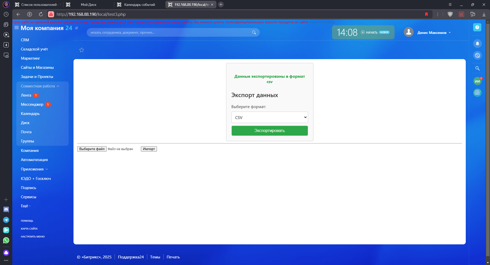
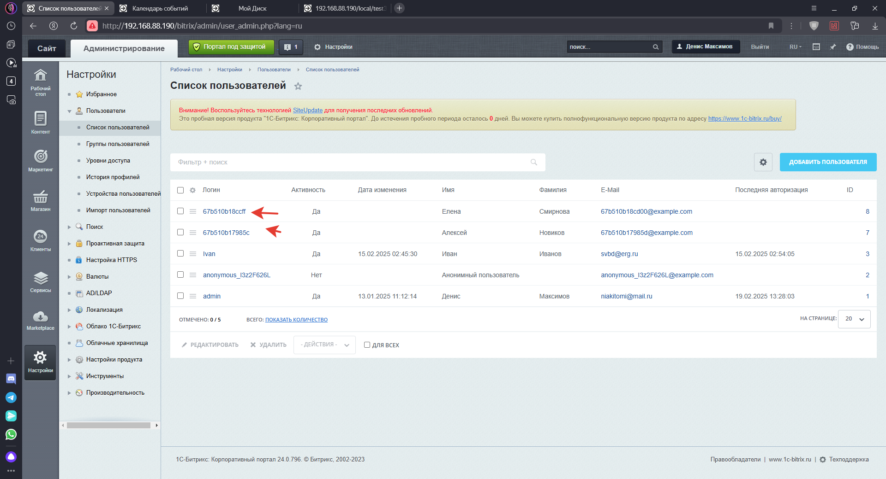

# Bitrix24-Calendar-export-import
 Экспорт, импорт событий из календаря Битрикс24

## Описание   
Компонент "Экспорт, импорт событий из календаря Битрикс24" предоставляет функциональность для импорта и экспорта пользователей и их событий в календарь и из календаря. Он включает минималистичное оформление и поддерживает работу с JSON-файлами для импорта и несколькими форматами для экспорта (CSV, XML, JSON).  

## Функциональность    

### Импорт    
Форма импорта: Содержит поле для загрузки JSON-файла и кнопку для запуска процесса импорта.    
Формат JSON: JSON-файл содержит следующие поля:   
Фамилия   
Имя   
Внешний код   
Дата события   
Название события   

Проверки:  
Если пользователь с указанным внешним кодом уже существует, он не будет создан повторно.    
Если у существующего пользователя уже есть событие в указанное время, новое событие не будет создано.    
Тестовый файл: Включен тестовый JSON-файл с 10 записями для проверки функциональности импорта (/www/test/test.json).        

### Экспорт     
Форма экспорта: Содержит выпадающий список для выбора формата экспорта (CSV, XML, JSON) и кнопку для запуска процесса экспорта.    
Форматы экспорта:   
CSV: разметка с полями "Фамилия", "Имя", "Дата события", "Название события", "Внешний код".    
XML: разметка с полями "Фамилия", "Имя", "Дата события", "Название события", "Внешний код".   
JSON: разметка с полями "Фамилия", "Имя", "Дата события", "Название события", "Внешний код".    
Сохранение файла: Экспортированный файл сохраняется в разделе "Экспорт событий" на Б24.Диске. Если раздела нет, он будет создан автоматически.    

## Технические детали    
Используются контроллеры для обработки отправки форм импорта и экспорта.    
Интерфейс выполнен в минималистичном стиле для удобства использования.    
  
## Установка и использование:        
Установить как обычный компонент "1C-Битрикс: Управление сайтом" в каталог /local/components    
В файле /www/test/index.php прописано подключение компонента        
В файле /www/test/test.json тестовые данные для проверки работы компонента     

Скриншоты     

    
   
   
   
   
     